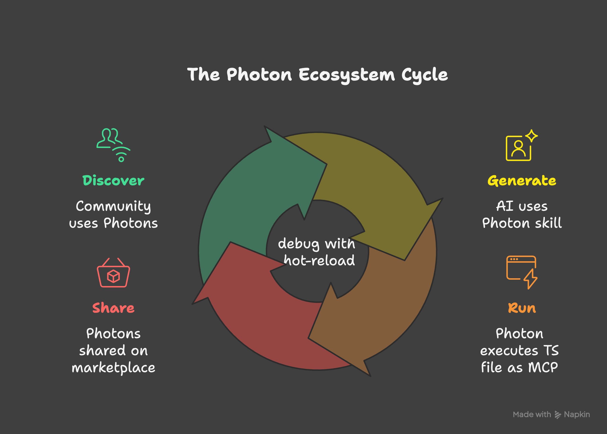

# Core Concepts

Five ideas that explain how Photon works. Each builds on the previous one.

---

## 1. Methods Are Tools

Every public method on your class becomes a tool — callable from the CLI, the web UI, and AI agents.

```typescript
export default class Calculator {
  add(params: { a: number; b: number }) {
    return params.a + params.b;
  }
}
```

- **CLI:** `photon cli calculator add --a 2 --b 3` → `5`
- **Beam:** A form with two number fields and an "Execute" button
- **MCP:** A tool named `calculator_add` with a JSON schema derived from the type

The method signature *is* the API. Parameters become inputs. The return value becomes the output. Nothing to register, no routes to define.

---

## 2. Comments Drive Everything

JSDoc comments aren't decorative — they're the primary configuration language. Photon reads them to generate descriptions, validation, UI hints, and behavior.

**Without comments:**

```typescript
export default class Weather {
  forecast(params: { city: string }) {
    return this._getForecast(params.city);
  }
}
```

The AI sees a tool called `forecast` with a `city` parameter. That's all it knows.

**With comments:**

```typescript
export default class Weather {
  /**
   * Get the 5-day weather forecast for a city
   * @param city City name {@example London} {@pattern ^[a-zA-Z\s]+$}
   * @format table
   * @cached 30m
   */
  forecast(params: { city: string }) {
    return this._getForecast(params.city);
  }
}
```

Now:
- The AI knows *when* to call this tool (weather questions) and *what* to pass
- Beam shows "London" as a placeholder and validates the pattern before submission
- Results render as a table instead of raw JSON
- Responses are cached for 30 minutes across all surfaces

One comment block configures three interfaces. See the [Tag Reference](reference/DOCBLOCK-TAGS.md) for every available tag.

---

## 3. Formats Control Presentation

The `@format` tag tells Photon how to render return values. Without it, data renders as JSON. With it, the same data becomes a table, chart, diagram, or dashboard.

```typescript
/** @format table */
list() { return this.items; }

/** @format chart:bar */
stats() { return this.salesData; }

/** @format metric */
revenue() { return { value: 142830, label: "Revenue", delta: "+12%" }; }

/** @format ring */
progress() { return { value: 73, max: 100, label: "Upload" }; }
```

Photon includes 30+ format types. Some are auto-detected from your data shape — time series become line charts, two-field arrays become pie charts. You can override with an explicit tag.

Formats work on every surface:
- **Beam** renders rich HTML (interactive charts, sortable tables, SVG gauges)
- **CLI** renders ASCII tables, colored text, compact summaries
- **MCP** returns structured data with format hints for the client

See the full gallery: [Output Formats](formats.md)

---

## 4. State Is Automatic

Add `@stateful` to your class and non-primitive properties are persisted to disk, restored on startup, and emit events on every change.

```typescript
/**
 * @stateful
 */
export default class Counter {
  private count = 0;

  increment() {
    this.count++;
    return { count: this.count };
  }
}
```

After calling `increment` three times, `count` is `3`. Restart the server — it's still `3`.

What `@stateful` gives you:
- **Disk persistence** — properties saved after every method call
- **Event emission** — every method broadcasts `{ method, params, result }` to subscribers
- **Object metadata** — returned objects get `__meta` with `createdAt`, `modifiedAt` timestamps
- **Real-time sync** — Beam auto-updates when data changes, no polling

No database setup. No serialization code. Just a tag.

---

## 5. One File, Three Surfaces

This is the core insight. You write intent once — what the tool does, what inputs it accepts, how results look, what rules apply — and Photon derives three interfaces from that single source of truth.

<div align="center">

</div>

```
todo.photon.ts
  ├── CLI        photon cli todo add --task "..."
  ├── Web UI     photon  →  localhost:3008
  └── MCP        photon mcp todo  →  Claude, Cursor, etc.
```

The three surfaces share:
- **Same validation** — type constraints and `@param` rules enforced everywhere
- **Same logic** — one method implementation, not three
- **Same data** — `@stateful` state is shared across all access paths
- **Same formatting** — `@format table` renders appropriately on each surface

When you add a `@cached 5m` tag, all three surfaces cache. When you add `@throttled 10/min`, all three enforce the rate limit. The annotations are surface-agnostic.

---

## Next Steps

| Ready to... | Go to |
|-------------|-------|
| See all format types | [Output Formats](formats.md) |
| Build something real | [Getting Started](getting-started.md) |
| Learn every tag | [Tag Reference](reference/DOCBLOCK-TAGS.md) |
| Build custom HTML views | [Custom UI](guides/CUSTOM-UI.md) |
| Read the full reference | [Developer Guide](GUIDE.md) |
