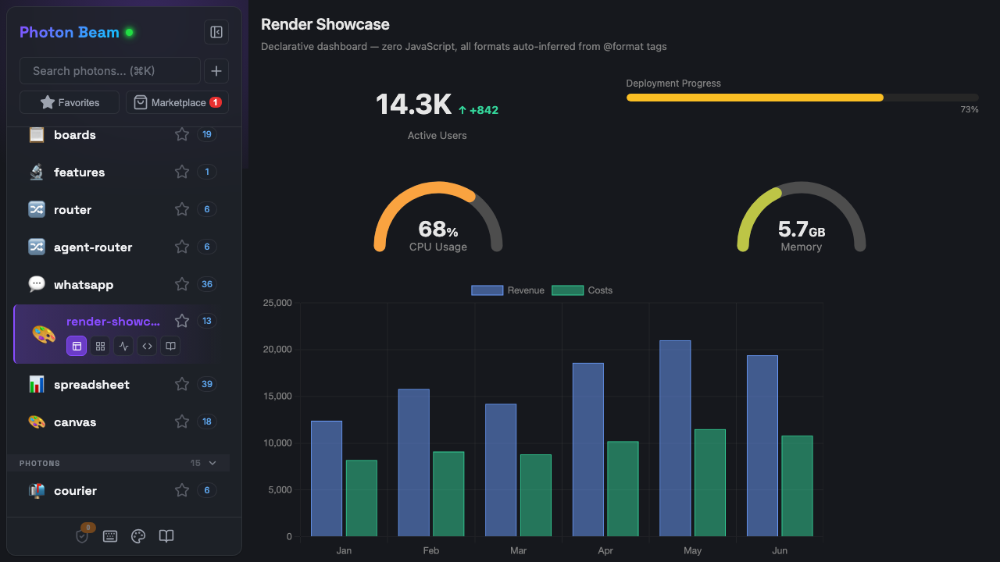

# Output Formats

Add `@format` to any method to control how its return value is displayed. Without it, Photon renders JSON. With it, you get tables, charts, diagrams, dashboards, and more.

Every format works on all three surfaces — Beam renders rich HTML, the CLI renders ASCII/text, and MCP returns structured data with format hints for the client.

<div align="center">

</div>

---

## Tables

### `@format table`

The default for arrays of objects. Sortable columns, paginated rows, and **expandable row details** (click any row to see all fields).

```typescript
/** @format table */
users() {
  return [
    { name: "Alice", email: "alice@co.com", role: "admin", joined: "2025-01-15" },
    { name: "Bob", email: "bob@co.com", role: "user", joined: "2025-03-20" },
  ];
}
```

Auto-detected cell rendering: dates are formatted, URLs become links, status fields get colored badges.

### Column Format Pipes

Apply per-column formatting with the `@columnFormats` hint:

```typescript
/** @format table {@columnFormats revenue:currency,margin:percent,name:truncate(20)} */
sales() {
  return [
    { name: "Enterprise North America", revenue: 142830, margin: 0.234 },
    { name: "Mid-Market Europe", revenue: 98450, margin: 0.182 },
  ];
}
```

| Pipe | Effect | Example |
|------|--------|---------|
| `currency` | Locale currency (default USD) | `$142,830.00` |
| `percent` | Percentage (values 0-1 are auto-scaled) | `23.4%` |
| `date` | Locale date format | `Jan 15, 2025` |
| `truncate(N)` | Cut to N characters with ellipsis | `Enterprise Nor...` |
| `number` | Locale number grouping | `142,830` |
| `compact` | K/M/B abbreviation | `142.8K` |

---

## Lists

### `@format list`

Styled list with title, subtitle, icon, and badge fields.

```typescript
/** @format list {@title name, @subtitle email, @badge role, @icon avatar} */
team() { return this.members; }
```

| Hint | Description |
|------|-------------|
| `@title` | Primary text field |
| `@subtitle` | Secondary text |
| `@icon` | Leading image/avatar |
| `@badge` | Status badge |
| `@style` | `plain`, `grouped`, `inset`, `inset-grouped` |

---

## Cards and Key-Value

### `@format card`

Single object rendered as a styled card.

### `@format kv`

Key-value pairs layout — good for settings, metadata, or single-record display.

### `@format grid`

Array rendered as a visual grid. Use `{@columns 3}` to control column count.

### `@format chips`

Array rendered as inline chip/tag elements.

### `@format tree`

Hierarchical/nested data rendered as an expandable tree.

---

## Charts

All chart types use [Chart.js](https://www.chartjs.org/). Photon auto-detects the best chart type from your data shape, or you can specify explicitly.

### `@format chart:bar`

```typescript
/** @format chart:bar {@label region, @value revenue} */
revenueByRegion() {
  return [
    { region: "Americas", revenue: 45000 },
    { region: "Europe", revenue: 38000 },
    { region: "Asia", revenue: 52000 },
  ];
}
```

### `@format chart:line`

Auto-detected for time series data (fields named `date`, `timestamp`, `createdAt`, etc.).

```typescript
/** @format chart:line */
signups() {
  return [
    { date: "2025-01-01", count: 120 },
    { date: "2025-02-01", count: 185 },
    { date: "2025-03-01", count: 240 },
  ];
}
```

### `@format chart:pie`

Auto-detected for 2-field arrays (one label + one number) with 8 or fewer items.

### `@format chart:scatter`

XY scatter plot. Auto-detected when data has 2+ numeric fields and no string fields.

```typescript
/** @format chart:scatter {@x height, @y weight} */
measurements() {
  return [
    { height: 170, weight: 68 },
    { height: 185, weight: 82 },
    { height: 162, weight: 55 },
  ];
}
```

### `@format chart:radar`

Radar/spider chart for multi-dimensional comparison. Auto-detected for single items with 5+ numeric fields, or few items with many numeric dimensions.

```typescript
/** @format chart:radar */
skills() {
  return [{ name: "Alice", coding: 9, design: 6, leadership: 7, communication: 8, testing: 8 }];
}
```

### `@format chart:histogram`

Bins numeric values into a frequency distribution bar chart. Explicit only — not auto-detected.

```typescript
/** @format chart:histogram {@x responseTime} */
latencyDistribution() {
  return this.requests.map(r => ({ responseTime: r.ms }));
}
```

### Other chart types

`chart:area` (line with fill), `chart:donut` (doughnut), `chart:hbar` (horizontal bar).

### Chart Hints

| Hint | Description |
|------|-------------|
| `@label` | Category/x-axis field |
| `@value` | Y-axis/size field |
| `@x` | Explicit x-axis field |
| `@y` | Explicit y-axis field |
| `@series` | Field to group into multiple datasets |

### Auto-Detection Rules

| Data shape | Detected type |
|------------|--------------|
| Date field + numeric field | `line` |
| 2+ numeric fields, no strings | `scatter` |
| 2 fields (1 string + 1 number), ≤8 items | `pie` |
| 1 item with 5+ numeric fields | `radar` |
| ≤5 items with 4+ numeric + 1 string | `radar` |
| Everything else | `bar` |

---

## Single Values

### `@format metric`

Big number display with optional label, delta, and trend arrow.

```typescript
/** @format metric */
revenue() {
  return { value: 142830, label: "Revenue", delta: "+12%", trend: "up" };
}
```

Data shape: `{ value, label?, delta?, trend? }` — `trend` is `"up"`, `"down"`, or `"neutral"`. A raw number also works.

### `@format gauge`

Semicircular gauge with color gradient (green → yellow → red).

```typescript
/** @format gauge {@min 0, @max 100} */
cpuUsage() {
  return { value: 73, label: "CPU" };
}
```

### `@format ring`

Full-circle progress ring with center value text.

```typescript
/** @format ring */
uploadProgress() {
  return { value: 73, max: 100, label: "Upload" };
}
```

Data shape: a number (0-100), `{ value, max?, label? }`, or `{ progress }` (0-1 normalized).

---

## Text and Diagrams

### `@format markdown`

Renders markdown with full formatting support.

### `@format mermaid`

Renders [Mermaid](https://mermaid.js.org/) diagrams from a string. Supports flowcharts, sequence diagrams, Gantt charts, and more.

```typescript
/** @format mermaid */
architecture() {
  return `graph LR
    A[Client] --> B[Photon]
    B --> C[CLI]
    B --> D[Beam]
    B --> E[MCP]`;
}
```

### `@format code` / `@format code:python`

Syntax-highlighted code block. Append a language name for specific highlighting.

### `@format slides`

Marp-style slide presentation. Separate slides with `---`. Supports layouts, transitions, and embedded photon output.

---

## Dashboards and Containers

### `@format dashboard`

Returns an object where each key becomes a panel. Photon auto-detects the best renderer for each value (numbers → metrics, arrays → tables, etc.).

```typescript
/** @format dashboard */
overview() {
  return {
    revenue: { value: 142830, delta: "+12%" },
    users: [{ name: "Alice", role: "admin" }, { name: "Bob", role: "user" }],
    uptime: { progress: 0.997 },
  };
}
```

### Container Formats

Wrap multiple sections with layout control:

| Format | Description |
|--------|-------------|
| `panels` | CSS grid of titled panels |
| `tabs` | Tab bar switching between sections |
| `accordion` | Collapsible sections |
| `stack` | Vertical stack with spacing |
| `columns` | Side-by-side columns (2-4) |

Data is an object — keys become section titles/tab labels, values are rendered using auto-detected formats.

---

## Specialty Formats

| Format | Description | Data Shape |
|--------|-------------|------------|
| `qr` | QR code | URL string or `{ url }` |
| `timeline` | Vertical event timeline | `[{ date, title, description? }]` |
| `cart` | Shopping cart with totals | `{ items: [{ name, price, quantity }] }` |
| `checklist` | Interactive checklist | `[{ text, done }]` |

---

## Layout Hints Reference

Hints are specified in curly braces after the format name:

```typescript
/** @format chart:bar {@label category, @value amount} */
/** @format list {@title name, @subtitle email, @style inset} */
/** @format table {@columnFormats price:currency,rate:percent} */
/** @format gauge {@min 0, @max 200} */
```

| Hint | Used by | Description |
|------|---------|-------------|
| `@title` | list, gauge, ring, timeline | Primary text field or label |
| `@subtitle` | list | Secondary text field |
| `@icon` | list | Leading image field |
| `@badge` | list | Status badge field |
| `@style` | list | Layout style variant |
| `@columns` | grid | Number of columns |
| `@label` | chart | Category/x-axis field |
| `@value` | chart | Y-axis/size field |
| `@x` | chart, histogram | X-axis or binning field |
| `@y` | chart | Y-axis field |
| `@series` | chart | Multi-dataset grouping field |
| `@min` | gauge | Minimum value (default: 0) |
| `@max` | gauge, ring | Maximum value (default: 100) |
| `@date` | timeline | Date field name |
| `@description` | timeline | Description field name |
| `@columnFormats` | table | Per-column format pipes |
| `@inner` | containers | Force inner renderer type |
| `@filter` | table, list | Enable client-side filtering |

---

## Declarative UI (A2UI v0.9)

### `@format a2ui`

Emits an [A2UI v0.9](https://a2ui.org) JSONL message stream derived from the return value. A2UI is Google's framework-agnostic declarative UI protocol; it rides on top of AG-UI, which Photon already speaks, so any AG-UI consumer that understands A2UI can render Photon output with no custom integration.

```typescript
/** @format a2ui */
async list() {
  return [
    { name: 'Alice', role: 'Eng' },
    { name: 'Bob', role: 'PM' },
  ];
}
```

**Auto-mapping** (v1, Basic catalog only):

| Return shape | A2UI layout |
|---|---|
| Array of objects | `List` with a `Card` template row |
| Single object | `Column` of `Text` rows (one per key) |
| `{ title, description, actions: [...] }` | `Card` with action buttons |
| Primitive | Single `Text` component |

**Escape hatch.** For full control, return the verbatim shape:

```typescript
/** @format a2ui */
async surface() {
  return {
    __a2ui: true,
    components: [
      { id: 'root', component: 'Card', child: 'header' },
      { id: 'header', component: 'Text', text: 'Custom', variant: 'h1' },
    ],
    data: {},
  };
}
```

**How it ships across transports:**

- **CLI:** prints the JSONL sequence (one message per line).
- **MCP / AG-UI:** each A2UI message is broadcast as an AG-UI `CUSTOM` event named `a2ui.message`. A consumer reassembles the JSONL stream. This is the primary integration path — paste the captured stream into [A2UI Theater](https://a2ui-composer.ag-ui.com/theater) to see it render.
- **Beam:** a preview renderer shows the raw JSONL (full A2UI rendering in Beam is a future feature).

Non-goals for the current version: stateful surface lifecycle across turns, action round-trip from the A2UI renderer back into photon methods, custom catalogs.

---

For the complete tag reference including non-format tags (caching, validation, middleware, MCP annotations), see [Tag Reference](reference/DOCBLOCK-TAGS.md).
