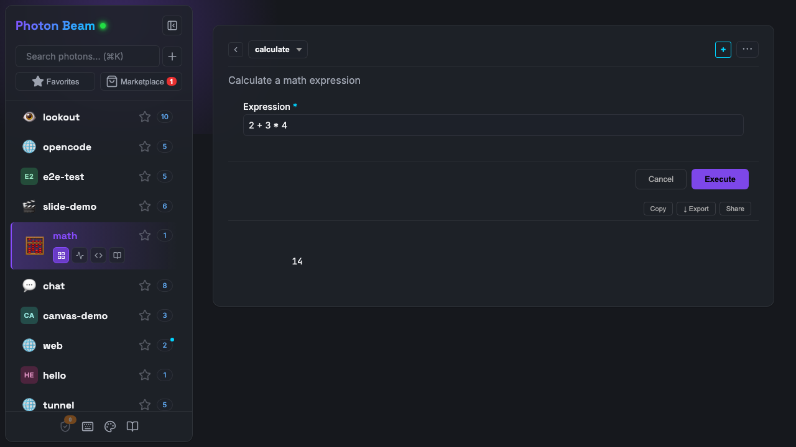

# Getting Started

One TypeScript file. Three interfaces. No boilerplate.

Photon turns a `.photon.ts` file into a **CLI tool**, a **web dashboard**, and an **MCP server** for AI agents. You write methods. Photon handles the rest.

---

## Install

```bash
npm install -g @portel/photon
```

> Requires [Node.js 20+](https://nodejs.org). TypeScript is compiled internally — no `tsconfig.json` needed.

---

## Your First Photon

Create a file called `todo.photon.ts` in any directory:

```typescript
// todo.photon.ts
export default class Todo {
  private items: { task: string; done: boolean }[] = [];

  /**
   * Add a task to the list
   */
  add(params: { task: string }) {
    this.items.push({ task: params.task, done: false });
    return this.items;
  }

  /**
   * List all tasks
   * @format table
   */
  list() {
    return this.items;
  }
}
```

That's 18 lines. Now run it three ways:

### Web UI (Beam)

```bash
photon
```

Open the browser. Your todo photon appears in the sidebar. Click **add**, type a task, hit execute. Click **list** to see a formatted table.

<div align="center">

</div>

### CLI

```bash
photon cli todo add --task "Buy milk"
photon cli todo list
```

Same logic, terminal output. The `@format table` tag renders as an ASCII table in the CLI.

### MCP Server (for AI)

```bash
photon mcp todo
```

Paste the connection config into Claude Desktop, Cursor, or any MCP-compatible client. The AI sees your methods as tools, with descriptions from your JSDoc comments.

---

## Make It Visual

Photon auto-renders return values based on their shape. Add `@format` tags to control how:

```typescript
/**
 * Task completion stats
 * @format chart:pie
 */
stats() {
  const done = this.items.filter(i => i.done).length;
  const pending = this.items.length - done;
  return [
    { status: "Done", count: done },
    { status: "Pending", count: pending },
  ];
}
```

The same data renders as a pie chart in Beam, structured JSON for the AI, and a text table in the CLI.

Other formats you can try right now:

| Tag | What it does |
|-----|-------------|
| `@format table` | Sortable table with expandable rows |
| `@format chart:bar` | Bar chart |
| `@format metric` | Big number with label and trend |
| `@format ring` | Circular progress indicator |
| `@format markdown` | Rendered markdown |
| `@format mermaid` | Mermaid diagrams |

See the full catalog in the [Output Formats](formats.md) guide.

---

## Add Persistence

Right now, restarting the server loses all data. Add `@stateful` to persist automatically:

```typescript
/**
 * A persistent todo list
 * @stateful
 */
export default class Todo {
  private items: { task: string; done: boolean }[] = [];

  // ... same methods as before
}
```

That's it. The `items` array is now saved to disk after every method call and restored on startup. No database, no config — just a tag.

---

## Add Comments, Get Superpowers

JSDoc comments aren't just documentation — they drive the AI's understanding, the CLI's help text, and the web form's labels and validation:

```typescript
/**
 * Add a task to the list
 * @param task What needs to be done {@example Buy groceries}
 */
add(params: { task: string }) {
  // ...
}
```

Now:
- **Beam** shows "What needs to be done" as the field label, with "Buy groceries" as placeholder
- **CLI** shows it in `--help` output
- **AI** reads it to understand when and how to call the tool

The more you express in comments and types, the more all three surfaces derive. One annotation, three consumers.

---

## What's Next?

You've built a working photon with persistence and visual output. Here's where to go from here:

| Want to... | Read |
|------------|------|
| Understand the mental model | [Core Concepts](concepts.md) |
| See all visual formats | [Output Formats](formats.md) |
| Build custom HTML interfaces | [Custom UI Guide](guides/CUSTOM-UI.md) |
| Add environment variables and config | [Complete Guide: Constructor Configuration](GUIDE.md#constructor-configuration) |
| Add OAuth authentication | [Authentication Guide](guides/AUTH.md) |
| Deploy to production | [Deployment Guide](guides/DEPLOYMENT.md) |
| Connect to other MCP servers | [MCP Dependencies](reference/MCP-DEPENDENCIES.md) |
| Browse everything | [Complete Developer Guide](GUIDE.md) |
