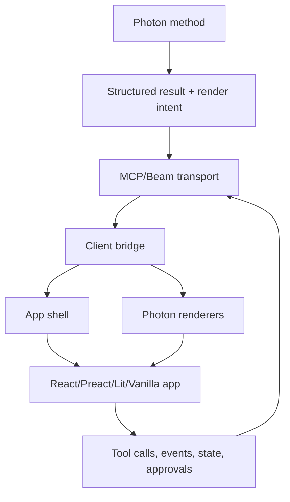

# Client-First UI Architecture

> Status: Proposal
> Date: 2026-05-29
> Motivation: Make Photon a reliable host and component platform for serious MCP apps, while keeping quick `.tsx` UIs useful for simple photons.

## Problem

Photon currently has three overlapping UI paths:

1. Auto UI formats generated from method output.
2. Custom UIs served through Beam/MCP Apps resources.
3. Built-in `.tsx` support with Photon's lightweight JSX runtime.

Those paths are useful, but the boundary is not sharp enough. When a serious app
such as Port runs through Beam, basic application behavior can fail or become
unclear: paste/focus/event handling, route ownership, cache invalidation,
service-worker isolation, destructive confirmations, and app reload behavior.

The target architecture is not "Photon server renders everything." The target is:

- Photon servers return structured data, render intent, and state events.
- The browser does the heavy UI work.
- Beam provides a reliable bridge, shell, and reusable component/rendering
  primitives.
- Applications can choose the right frontend runtime: Photon TSX, vanilla,
  Lit/Web Components, React, Preact, Svelte, Vue, or another compiled app.

## Design Goals

- **Client-first rendering:** Keep server output lightweight and structured.
- **Framework neutrality:** Photon must host compiled frontend assets from any
  framework.
- **Reusable built-ins:** Photon formats should be available as client-side
  renderers/components, not only server-produced HTML.
- **Protocol compliance:** MCP wire payloads stay standard. Beam-specific UI
  metadata uses `_meta` or internal bridge metadata.
- **Reliable app hosting:** Beam must not leak its own dashboard/offline shell
  into linked app routes.
- **Simple path remains simple:** `.tsx` stays good for small UIs and forms.
- **Serious apps get serious tooling:** Large apps may use Vite/React/Preact/Lit
  and ship built assets.

## Non-Goals

- Do not turn Photon's built-in TSX runtime into a full React clone.
- Do not require app authors to use React.
- Do not make Beam's default dashboard the only viable application shell.
- Do not invent new MCP protocol fields when `_meta`, resources, tools, and
  elicitation already cover the contract.

## Architecture



Photon owns the protocol and hosting surface. The app owns layout and product
interaction. Photon renderers are optional building blocks inside that app.

## Render Contract

Every renderable method result should be representable as:

```ts
interface PhotonRenderEnvelope<T = unknown> {
  data: T;
  format?: string;
  intent?: RenderIntent;
  schema?: unknown;
  ui?: {
    resourceUri?: string;
    component?: string;
    props?: Record<string, unknown>;
  };
  meta?: Record<string, unknown>;
}

interface RenderIntent {
  title?: string;
  description?: string;
  subject?: string;
  density?: 'compact' | 'comfortable' | 'spacious';
  actions?: Array<{
    id: string;
    label: string;
    tool?: string;
    destructive?: boolean;
    input?: Record<string, unknown>;
  }>;
  pagination?: {
    cursor?: string;
    limit?: number;
    hasMore?: boolean;
  };
  columns?: Array<{
    key: string;
    label?: string;
    type?: string;
    sortable?: boolean;
    width?: string;
  }>;
}
```

This envelope can appear as MCP `structuredContent`, Beam bridge state, or
internal renderer input. Basic clients still receive readable `content[].text`.

## Client Renderer Contract

Beam should expose client-side render primitives with stable APIs:

```ts
photon.render(container, data, format, options);
photon.createRenderer(format, options);
photon.components;
```

The built-in renderers should be reusable in any custom app:

```tsx
function SessionToolBlock({ toolResult }) {
  return (
    <section>
      <h3>{toolResult.title}</h3>
      <photon-json-viewer value={toolResult.structuredContent} />
    </section>
  );
}
```

Recommended built-in component direction:

- Implement built-in format renderers as framework-neutral Web Components where
  practical.
- Provide thin React/Preact wrappers later, but do not require them.
- Keep `photon.render()` for vanilla/simple templates.

## Built-In Format Responsibilities

Photon formats should progressively move from server-heavy rendering to
client-side rendering:

| Format type | Server responsibility | Client responsibility |
| --- | --- | --- |
| `table` / `datatable` | data, columns, schema, pagination cursors | sorting, filtering, virtual scroll, row expansion |
| `chart:*` | series data, axes, labels, units | chart rendering, resize, hover, legends |
| `json` / `code` / `diff` | structured payload, language/file metadata | syntax display, folding, copy, wrapping |
| `timeline` / `feed` | ordered events and labels | grouping, expansion, relative time |
| `form` / elicitation | JSON schema and defaults | validation UI, focus, keyboard, submit state |
| `approval` | method context, risk, schema, safe preview | decision UI, audit display, action buttons |

The server may still produce a text fallback for terminals and non-UI MCP
clients.

## Custom App Contract

Photon custom apps may be:

- `.html` or `.photon.html`
- `.tsx` or `.photon.tsx` using Photon's built-in runtime
- prebuilt static assets from any framework

For compiled apps, Photon should document and support:

```txt
ui/
  app.html
  assets/index-abc123.js
  assets/index-def456.css
```

or:

```txt
ui/
  dist/index.html
  dist/assets/...
```

The `@ui` tag should be able to point at the built `index.html`, and Beam must
serve sibling chunks/assets with correct paths, cache headers, and MIME types.

## Bridge Contract

The bridge is the heart of client-first UI. It must be stable across Photon TSX,
React, Lit, vanilla, and external MCP Apps hosts.

Required APIs:

```ts
interface PhotonBridge {
  readonly photon: string;
  readonly method?: string;
  readonly toolInput: Record<string, unknown>;
  readonly toolOutput: unknown;
  readonly structuredContent?: unknown;
  readonly widgetState: unknown;
  readonly theme: 'light' | 'dark';
  readonly locale: string;
  readonly safeAreaInsets: { top: number; right: number; bottom: number; left: number };

  callTool(name: string, args?: Record<string, unknown>): Promise<unknown>;
  setWidgetState(state: unknown): void;
  render(container: HTMLElement, data: unknown, format: string, opts?: object): void;

  onResult(cb: (result: unknown) => void): () => void;
  onStructuredContent(cb: (content: unknown) => void): () => void;
  onProgress(cb: (event: { value?: number; message?: string }) => void): () => void;
  onStatus(cb: (event: { message: string }) => void): () => void;
  onEmit(cb: (event: { emit: string; data?: unknown }) => void): () => void;
  onError(cb: (error: unknown) => void): () => void;
  onThemeChange(cb: (theme: 'light' | 'dark') => void): () => void;
  onTeardown(cb: () => void): () => void;
}
```

Direct photon globals such as `kanban.taskMove()` and `kanban.onTaskMove()`
remain useful sugar over `callTool()` and `onEmit()`.

## TSX Runtime Responsibilities

If Photon advertises `.tsx` as a supported UI authoring path, the runtime must
honor core browser semantics:

- Paste works in `input`, `textarea`, and content-editable controls.
- Controlled and uncontrolled form controls behave predictably.
- Focus, selection, and cursor position survive rerenders.
- Event handlers do not stack after rerenders.
- Form submit, Enter, Escape, Tab, and composition/IME behavior are not broken.
- Keyed children preserve DOM identity.
- Route links and browser history work for app routes.
- Source edits invalidate compiled JS and HTML shells.
- The service worker never serves Beam's offline shell for linked app routes.

This does not require React parity. It requires basic DOM correctness.

## Hosting Responsibilities

Beam must behave as a reliable app host:

- Serve linked app routes under `/web/<photon>/...`.
- Reserve only Beam/MCP runtime paths from linked apps.
- Rewrite same-origin redirects back into the mounted app path.
- Serve static chunks beside a compiled app entry.
- Apply `no-cache` to HTML shells and content-hashed immutable caching to assets.
- Scope service-worker caches by Beam owner/workdir/version fingerprint.
- Never let a previous Beam instance mask a different app on the same port.
- Provide a diagnostics endpoint that identifies Beam, version, working dir, and
  active linked apps.

## Elicitation And Approval UI

MCP wire payloads remain standard. Beam can enrich the UI with safe context.

For destructive tool calls, the user-facing approval must show:

- Photon/server name.
- Method name and human title.
- Method description.
- Risk category.
- Safe argument preview.
- Whether the call is coming from a tool, app UI, automation, or MCP client.

Implementation rule:

- Use standard MCP `elicitation/create` fields for the request.
- Use `_meta` or Beam-internal metadata for display-only extras.
- Do not add arbitrary top-level fields to MCP elicitation params.
- Do not expose secrets in previews.

## Port As A Reference App

Port should be treated as a reference for the compiled-app path:

- Port owns its professional remote-session layout.
- Photon owns hosting, bridge, routing, state delivery, and built-in render
  primitives.
- Port may use Photon renderers for transcript blocks such as JSON, code, diff,
  command output, status, approvals, and timelines.
- Port should not depend on Beam's dashboard layout for its product UI.

## Test Requirements

Photon should have regression tests for:

1. Linked app navigation never falls through to Beam's offline shell.
2. Service-worker cache names are owner-scoped.
3. Compiled app static chunks load under `/web/<photon>/...`.
4. TSX source edits invalidate the visible browser route.
5. Paste, focus, selection, submit, and keyboard behavior in TSX controls.
6. Event handlers do not stack after repeated rerenders.
7. Destructive approvals display method context and argument preview while MCP
   elicitation payloads remain spec-shaped.
8. Two browser clients connected to the same stateful photon receive updates.
9. Hard reload after Beam restart does not show stale app HTML.
10. `/api/diagnostics` identifies the currently running Beam owner.

The initial contract tests live in:

```txt
tests/beam/port-hosting-regressions.test.ts
```

## Migration Plan

1. Lock current hosting regressions with failing tests.
2. Fix Beam service-worker cache scoping and linked-app route isolation.
3. Add MCP-safe approval display metadata and modal rendering.
4. Document compiled app layout and chunk serving rules.
5. Make `photon.render()` and built-in renderers stable enough for external apps.
6. Harden TSX runtime form/event/focus behavior.
7. Convert Port to a compiled professional app if its UI complexity continues to
   exceed Photon TSX's intended scope.

## Decision

Photon should be both:

- a fast path for simple `.tsx` UIs, and
- a serious host for compiled frontend apps.

The bridge and client-side renderers are the shared platform. That is where
Photon should invest. The built-in TSX runtime should be correct and useful,
but it should not be the only or preferred path for complex applications.
