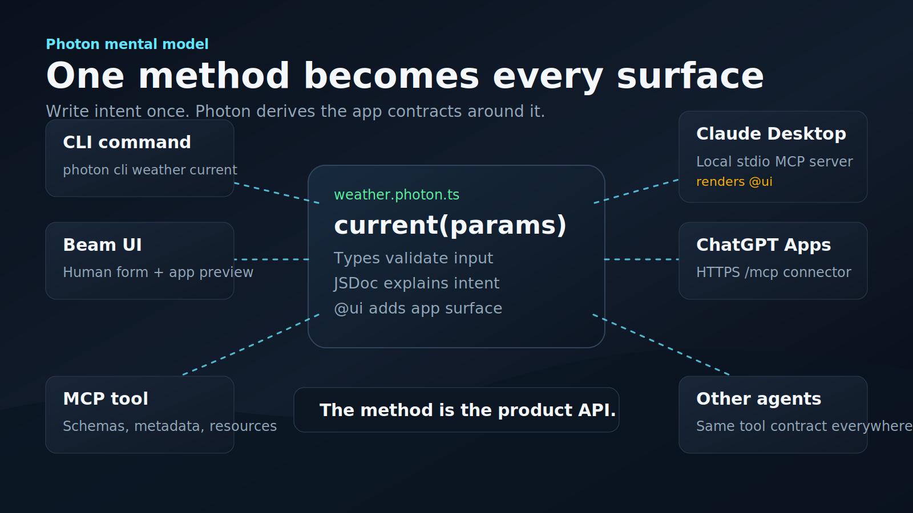
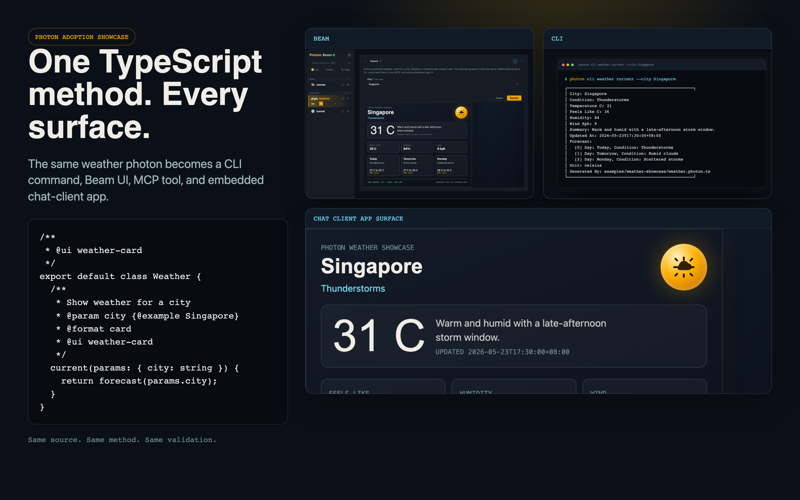
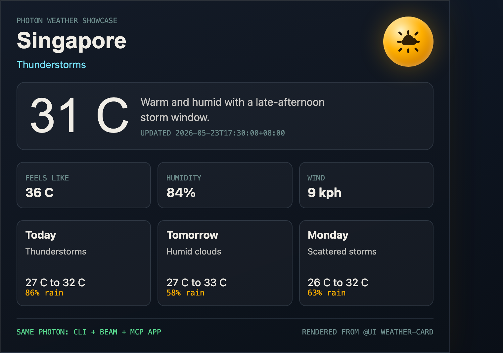
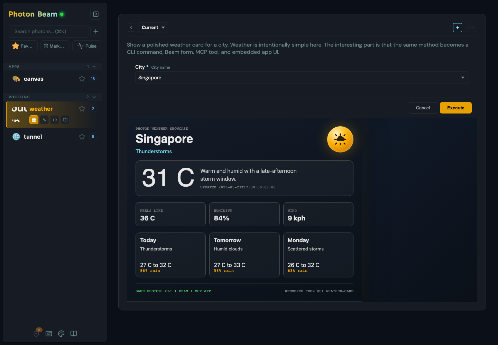
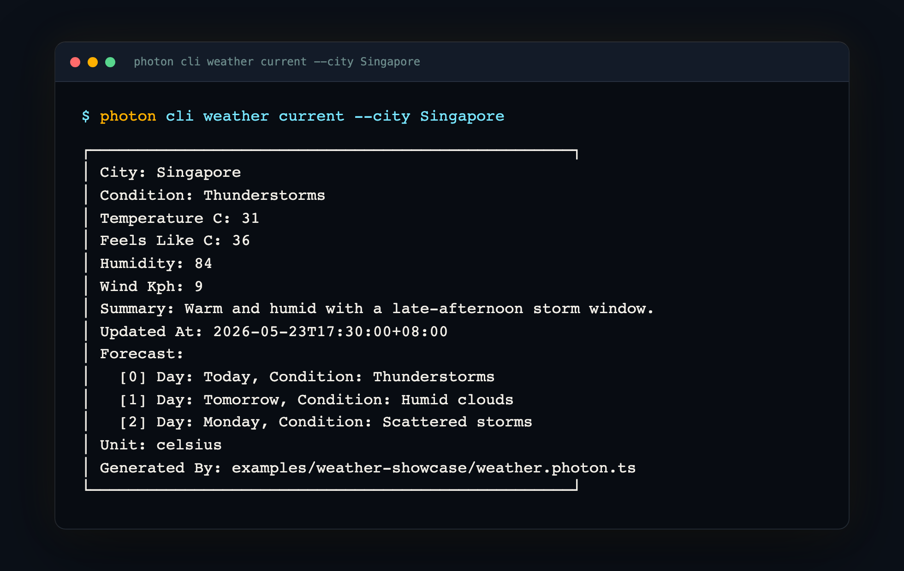
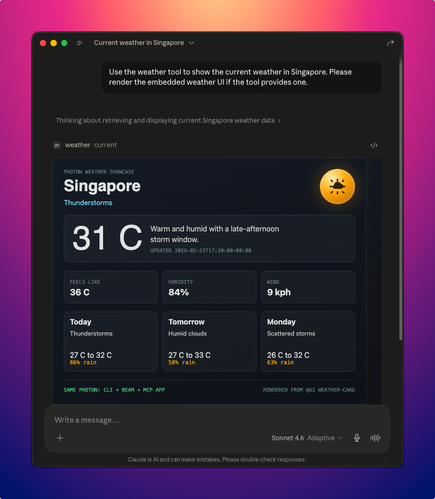
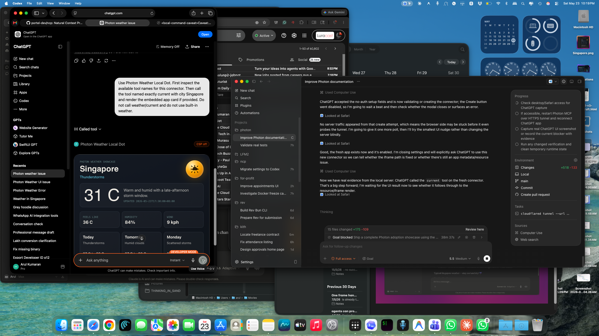
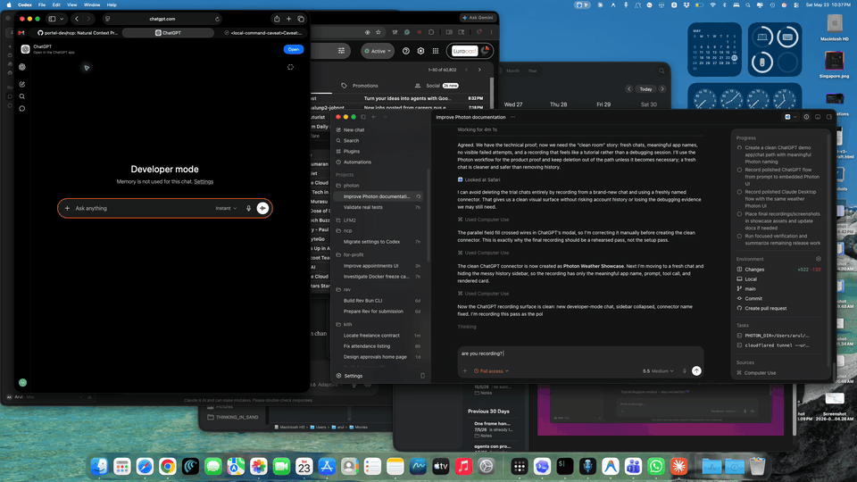

# From TypeScript Method to Embedded Chat UI

Weather is intentionally simple here. The point is not weather. The point is
that one TypeScript method can become a CLI command, a Beam form, an MCP tool,
and an embedded app surface for MCP app-capable chat clients.





The complete example lives in
[`examples/weather-showcase/weather.photon.ts`](../../examples/weather-showcase/weather.photon.ts).

---

## 1. Start with a Method

```ts
export default class Weather {
  current(city: string) {
    return forecast(city);
  }
}
```

That is the core Photon move: the method is the capability. Photon can expose
that capability through multiple surfaces without a separate CLI parser, web
form, MCP schema, or app wrapper.

## 2. Add Intent

```ts
/**
 * Show a polished weather card for a city.
 *
 * @param city City name {@example Singapore} {@choice Singapore,London,San Francisco}
 * @format card
 * @readOnly
 */
current(params: { city: string }) {
  return forecast(params.city);
}
```

Those comments are not decorative. Photon uses them to shape the generated
form, CLI help, MCP tool description, validation, and default result renderer.

## 3. Add an App UI

```ts
/**
 * @ui weather-card
 */
export default class Weather {
  /**
   * @ui weather-card
   */
  current(params: { city: string }) {
    return forecast(params.city);
  }
}
```

The class-level `@ui weather-card` resolves to
[`ui/weather-card.html`](../../examples/weather-showcase/ui/weather-card.html).
That HTML receives the method result through the Photon bridge and renders the
same weather card in Beam and in MCP app-capable clients.



## 4. Run It in Beam

```bash
cd examples/weather-showcase
node ../../dist/cli.js beam
```

Select `weather`, choose the `current` method, pick `Singapore`, and execute.
Beam renders the custom UI from the real method result.



## 5. Run the Same Method from CLI

```bash
cd examples/weather-showcase
node ../../dist/cli.js cli weather current --city Singapore
```



## 6. Render in Chat Clients

MCP app-capable clients can render the same `@ui` asset when the tool result is
returned. Claude Desktop renders the weather Photon as an embedded MCP app UI
inside the chat after the model calls the `current` tool.



ChatGPT Apps use MCP too. The important difference is that ChatGPT connects to
a public HTTPS `/mcp` endpoint rather than a local stdio command. For local
development, expose Photon with a temporary tunnel:

```bash
cd examples/weather-showcase
node ../../dist/cli.js mcp weather --transport sse --port 3479
cloudflared tunnel --url http://localhost:3479
```

Then in ChatGPT:

1. Open **Settings -> Apps & Connectors -> Advanced settings**.
2. Enable **Developer mode**.
3. Create a new app.
4. Set the app URL to your tunnel's public `/mcp` endpoint.
5. Choose **No Auth** for this demo.
6. Start a new developer-mode chat and add the app from the composer.
7. Ask ChatGPT to call `current` with `{ "city": "Singapore" }`.

The OpenAI Apps SDK docs describe the same flow: apps are MCP servers, optional
web components render in ChatGPT, and developer-mode connectors need a public
HTTPS `/mcp` URL.

- [OpenAI Apps SDK quickstart](https://developers.openai.com/apps-sdk/quickstart)
- [Connect an app from ChatGPT](https://developers.openai.com/apps-sdk/deploy/connect-chatgpt)
- [Apps SDK reference](https://developers.openai.com/apps-sdk/reference)

In a live ChatGPT developer-mode session, the same local Photon build advertises
slashless tools (`current`, `cities`) and the app template
`ui://weather/weather-card`. ChatGPT calls `current`, reads the UI resource, and
renders the weather card inline.



The flow below is a real screen recording of the same connector: prompt,
tool call, and embedded UI render from one local Photon.



A redacted connection proof is checked in at
[`assets/showcase/weather/chatgpt-mcp-proof.txt`](../../assets/showcase/weather/chatgpt-mcp-proof.txt).
It records the OpenAI-style MCP probe, the advertised `openai/outputTemplate`
metadata, the slashless tool names, and the `resources/read` response for the
app card.

## 7. The Transformation as a Concept Animation

The animated walkthrough is explanatory, not proof. It shows the idea without
depending on a particular live desktop layout: method, intent, CLI, Beam, and
chat-client UI all come from the same Photon source.


## What This Demonstrates

- The method is the durable capability.
- JSDoc describes intent once for humans, CLIs, and AI clients.
- `@format` gives every surface a presentation hint.
- `@ui` adds a custom app surface without changing the backend method.
- Beam, CLI, MCP, and chat-client app surfaces all share the same source.
